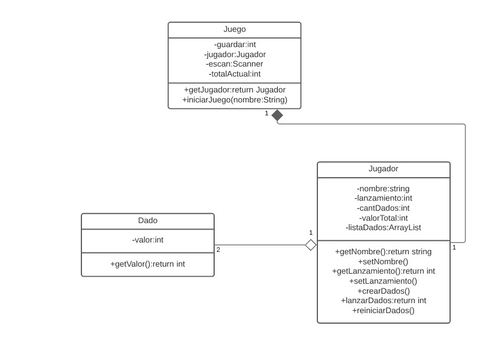

# JuegoDados 🎲

Es un juego muy simple de dados llamado *Craps*, el cual consiste en que un Jugador va a lanzar un **par** de dados.
En el primer lanzamiento de dados:
#### **Reglas:**
1. Si obtiene un **7** o un **11**, automáticamente *gana*
2. Si obtiene **12**, **2** ó **3**, automáticamente *pierde*
3. Si obiente cualquier otro número, debe repetir el lanzamiento y ***cambian las reglas:***
#### **Nuevas Reglas:**
1. Si saca **7**, automáticamente *pierde*
2. Si  saca el mismo número que obtuvo la primera vez, automáticamente *gana*
3. Si saca cualquier otro número, debe seguir hasta que se cumpla una de las dos primeras reglas

### Un ejemplo 📋

_Un Jugador lanza los dados:_

```
El valor del dado 1 es: 1 Y el valor del dado 2 es: 3
Para un total de: 4

//Debemos volver a lanzar (Cambian las reglas)

El valor del dado 1 es: 2 Y el valor del dado 2 es: 5
Para un total de: 7
Perdiste
Gracias por jugar!
```


## Desarrolladores👨‍💻


* Santiago Andrés Garzón Monroy - 20192020103.
* Jhonatan David Moreno Barragám - 20201020094.
* Brayan Alejandro Riveros Rodríguez - 20201020084.


_Estudiantes de Ingenieria de Sistemas de la Universidad Distrital_


## Diagrama de UML 🖇
Puedes también encontrar el diagrama en Lucidchart: 
* [Diagrama en UML](https://lucid.app/lucidchart/e5f2e00a-3610-466f-b8b4-211649de9fd1/view)



## Principios Utilzados ✔
##### **Demeter:**

En que el jugador solo se limita a tirar los dados, sin saber el proceso que hay detras, por ende son necesarios los getters y setters Entonces las clases no conocen los atributos de las otras, solo el funcionamiento

##### **Responsabilidad unica:**

La clase dado tiene una única responsabilidad, que es el dar un numero, por lo tanto tiene una única razón para cambiar
